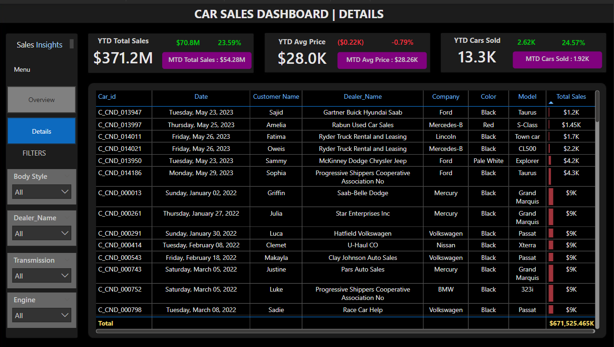

# 🚗 Car Sales Dashboard – Power BI Project

### 📸 Dashboard Previews

**🔹 Overview Dashboard**  

**🔹 Details Dashboard**  

This Power BI project visualizes comprehensive sales performance metrics for a car dealership network. The dashboard delivers clear insights into Year-to-Date (YTD), Month-to-Date (MTD), and Year-over-Year (YOY) performance across vehicle types, dealer regions, and customer preferences — enabling data-driven decisions for sales and operations teams.

---

## 🧩 Problem Statement

The objective of this project is to design and develop a dynamic and interactive Car Sales Dashboard using Power BI. The goal is to help dealership executives and analysts:

- Monitor overall sales performance
- Compare trends against previous years
- Identify high-performing regions, brands, and body styles
- Drill down into customer and vehicle-level details

---

## 📌 KPIs Tracked

- **YTD Total Sales**
- **MTD Total Sales**
- **YOY Growth % in Total Sales**
- **YTD Average Price**
- **MTD Average Price**
- **YTD Cars Sold**
- **MTD Cars Sold**
- **YOY Growth % in Cars Sold**
- **Comparisons with PTYD (Previous Time Year-to-Date)**

---

## 📊 Visualizations

| Dashboard Section                      | Chart Type        | Purpose                                                                 |
|----------------------------------------|-------------------|-------------------------------------------------------------------------|
| YTD Sales Weekly Trend                 | Line Chart        | Weekly movement of total car sales                                     |
| Total Sales by Body Style              | Donut Chart       | Revenue contribution from SUVs, Sedans, Hatchbacks                     |
| Total Sales by Car Color               | Donut Chart       | Distribution of sales by car color                                     |
| Cars Sold by Dealer Region             | Map Chart         | Geographical analysis of dealership performance                        |
| Company-Wise Sales Trend               | Bar Table         | Average price, volume, and revenue by car brand                        |
| Detailed Sales Log                     | Table             | Full transactional data with customer name, date, model, dealer, etc.  |

---

## 🛠 Tools & Techniques Used

- **Power BI Desktop**
- **Power Query Editor**:
  - For transforming raw sales data and cleaning null values
  - Date formatting and column extraction (week, month)
- **DAX Measures**:
  - `YOY % Growth`
  - `MTD vs PTYD Variance`
  - Rolling sales & car count metrics
- **Calculated Columns**:
  - Profit segmentation, week numbers, and price buckets
- **Slicers/Filters**:
  - Body Style, Dealer Name, Transmission, Engine
- **Navigation**:
  - Custom buttons to toggle between Overview and Details views

---

## 📁 Files Included

- `Car_Sales_Analysis.pbix` – Complete Power BI dashboard file  
- `Overview_Dashboard.png` – High-level analytics visual  
- `Details_Dashboard.png` – Customer-level transaction details visual  
- `Problem Statement.docx` – Requirement & business objective

---

## 💡 Key Insights

- 🚘 **$371.2M** in YTD Total Sales with **23.59% YOY Growth**  
- 📉 YTD Avg Price is **$28K**, down slightly by **0.79%**  
- 🚗 Over **13.3K cars sold YTD**, up **24.57%** from last year  
- 🥇 **SUVs** are the most profitable body style  
- 🎨 **Black and Red** cars dominate revenue contributions  
- 🏆 **Chevrolet** leads in unit sales with over 1K cars sold  
- 🌍 **Austin** and **Scottsdale** are the top-performing regions  

---

## 🧠 Features Implemented

- Dynamic cards for YTD & MTD comparison
- Custom tooltips with context-based highlights
- Interactive region map (with Bing Maps)
- Drill-through style table for transaction-level details
- Modern **dark theme** layout for better visibility and UX

---

## 🚀 Future Enhancements

- Add Forecasting visuals for monthly/quarterly predictions
- Include Sales Rep-level performance analytics
- Create segmented dashboards by engine or fuel type
- Connect to live dealership SQL or API for real-time tracking

---

