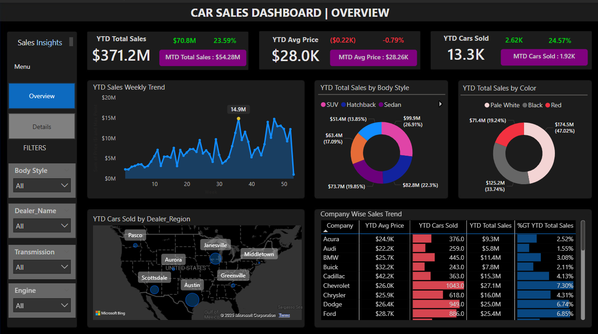

# 🚗 Car Sales Dashboard – Power BI Project

### 📸 Dashboard Preview

This Power BI project visualizes comprehensive sales performance metrics for a car dealership network. The dashboard delivers clear insights into Year-to-Date (YTD), Month-to-Date (MTD), and Year-over-Year (YOY) performance across vehicle types, dealer regions, and more — enabling data-driven decision-making for sales teams and management.

---

## 🧩 Problem Statement

The objective of this project is to design and develop a dynamic and interactive Car Sales Dashboard in Power BI. The goal is to track KPIs in real time and better understand sales trends, price patterns, and vehicle performance by various attributes such as body style, color, and dealership region.

---

## 📌 KPIs Tracked

- **YTD Total Sales**
- **MTD Total Sales**
- **YOY Growth in Total Sales**
- **YTD Average Price**
- **MTD Average Price**
- **YTD Cars Sold**
- **MTD Cars Sold**
- **YOY Growth in Cars Sold**
- **Comparisons with Previous Year (PTYD)**

---

## 📊 Visualizations

| Visualization Title                     | Type             | Description                                                              |
|----------------------------------------|------------------|---------------------------------------------------------------------------|
| YTD Sales Weekly Trend                 | Line Chart       | Visualizes weekly trends in YTD sales                                    |
| YTD Total Sales by Body Style          | Donut Chart      | Shows sales distribution across SUV, Sedan, Hatchback, etc.              |
| YTD Total Sales by Color               | Donut Chart      | Displays color-wise revenue contribution                                 |
| YTD Cars Sold by Dealer Region         | Map Chart        | Geographically plots dealer-level performance                            |
| Company-Wise Sales Trend               | Grid/Matrix      | Lists each company with metrics like YTD cars sold, avg price, total sales |
| Sales Details Table                    | Table/Grid       | Detailed view showing model, price, style, dealer, date, region, etc.    |

---

## 🔧 Tools & Techniques Used

- **Power BI Desktop**
- **Power Query Editor** for data cleaning and shaping
- **DAX Measures** for:
  - YOY % change calculations
  - Dynamic variance between YTD & PTYD
  - Weekly sales roll-up and KPI logic
- **Interactive Filters** for:
  - Body Style
  - Dealer Name
  - Transmission Type
  - Engine Type
- **Navigation Buttons** for moving between Overview and Details

---

## 💡 Key Insights from the Dashboard

- **$371.2M** in YTD Total Sales with **23.59% YOY Growth**
- YTD Average Car Price is **$28K**, slightly down by 0.79%
- Over **13.3K Cars Sold YTD**, a **24.57% increase** from last year
- **SUVs** lead in sales volume, followed closely by Sedans and Hatchbacks
- **Red and Black cars** account for the majority of YTD revenue
- **Chevrolet and Ford** are top-selling brands by volume and value
- **Austin and Scottsdale** lead among dealer regions

---

## 🗺️ Features Implemented

- YOY metrics with dynamic variance
- Map visualization for regional breakdown
- Filter panel for multi-dimensional exploration
- Clean dark-themed UX for readability
- Responsive layout with tab-based navigation (Overview, Details)

---

## 📁 Files Included

- `Car_Sales_Analysis.pbix` – Final Power BI file
- `Overview_Dashboard.png` – Visual preview of the main dashboard

---

## 🚀 Future Enhancements

- Add Forecasting based on seasonal trends
- Enable drill-through to individual sales rep performance
- Track campaign effectiveness or promotions
- Real-time integration via live database/API connections

---

